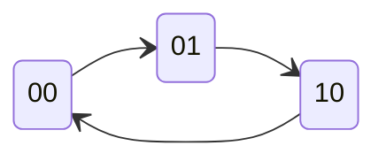

# Jawaban Soal Nomor 1
Jelaskan empat jenis sistem bilangan (Desimal, Biner, Oktal, Hexadesimal) disertai:
- Contoh konversi: 75 desimal → biner, oktal, hexadecimal
- Contoh konversi: 110101 biner → desimal dan hexadecimal
- Jelaskan mengapa sistem biner digunakan dalam rangkaian digital
### Penjelasan: Empat Jenis Sistem Bilangan
1.  **Desimal (Basis 10):** Sistem yang kita gunakan sehari-hari. Terdiri dari 10 simbol angka (0-9).
2.  **Biner (Basis 2):** Sistem bilangan Biner hanya memiliki 2 simbol, yaitu 0 dan 1. Yang merupakan komponen dasar atau bahasa dasar komputer.
3.  **Oktal (Basis 8):** Sistem bilangan memiliki 8 simbol (0-7). Sering digunakan untuk menyingkat penulisan biner (3 bit biner = 1 digit oktal).
4.  **Hexadesimal (Basis 16):** Sistem bilangan dengan 16 simbol (0-9 dan A-F). Digunakan untuk representasi data yang lebih ringkas (4 bit biner = 1 digit hexa).

### A. Konversi Bilangan Desimal: 75
Cara menghitung konversi angka **75 (desimal)** ke sistem lain:
**1. Desimal ke Biner (Membagi dengan 2)**
Lakukan pembagian berulang dengan 2 dan catat sisa baginya (Remainder) dari bawah ke atas.
* $75 \div 2 = 37$, sisa **1** 
* $37 \div 2 = 18$, sisa **1**
* $18 \div 2 = 9$, sisa **0**
* $9 \div 2 = 4$, sisa **1**
* $4 \div 2 = 2$, sisa **0**
* $2 \div 2 = 1$, sisa **0**
* $1 \div 2 = 0$, sisa **1** 

$$Hasil: 75_{10} = 1001011_{2}$$

**2. Desimal ke Oktal (Konversi dari Biner)**
Cara termudah adalah mengelompokkan hasil biner di atas menjadi 3 bit dari kanan.
* Biner: `001` | `001` | `011`
* Desimal: `1` | `1` | `3`

$$Hasil: 75_{10} = 113_{8}$$

**3. Desimal ke Hexadesimal (Konversi dari Biner)**
Kelompokkan hasil biner menjadi 4 bit dari kanan.
* Biner: `0100` | `1011`
* Nilai: `4` | `11` (Dalam Hexa, 11 = B)

$$Hasil: 75_{10} = 4B_{16}$$


---

### B. Konversi Bilangan Biner: 110101
Cara menghitung konversi **110101 (biner)**:

**1. Biner ke Desimal**
Jumlahkan nilai posisi bit yang bernilai 1 (kalkulasi bobot $2^n$).
$$

(1 \times 32) + (1 \times 16) + (0 \times 8) + (1 \times 4) + (0 \times 2) + (1 \times 1) \\
= 32 + 16 + 0 + 4 + 0 + 1 \\
= 53_{10}

$$

**2. Biner ke Hexadesimal**
Kelompokkan 4 bit dari kanan.
* Kelompok 1 (Kanan): `0101` $\rightarrow$ Nilai desimalnya 5.
* Kelompok 2 (Kiri): `0011` (tambahkan nol di depan) $\rightarrow$ Nilai desimalnya 3.

$$Hasil: 110101_{2} = 35_{16}$$

### C. Mengapa Menggunakan Sistem Biner?
Dalam rangkaian digital, sistem biner digunakan karena perangkat elektronik (hardware) lebih mudah dirancang untuk mengenali **2 level tegangan** saja daripada 10 level tegangan.
* **Logic 0 (Low):** Tegangan 0 - 0.8 V.
* **Logic 1 (High):** Tegangan 2 - 5 V.
Sistem ini meminimalkan kesalahan deteksi sinyal dibandingkan jika harus membedakan 10 level tegangan yang berbeda.

---

# Jawaban Soal Nomor 2
Rancang state machine dengan 3 state (SO, S1, S2) menggunakan salah satu flip-flop: SR, D, T, atau JK.
Langkah yang harus dilakukan:
- Buat tabel transisi.
- Tentukan input FF berdasarkan karakteristiknya.
- Gambar rangkaian akhir.

### A. Buat tabel transisi (State Transition Table)
Ambil 2 bit ($Q_1$ dan $Q_0$) untuk menampung 3 state (karena $2^2 = 4$ kombinasi, cukup untuk 3 state).
* **S0:** 00
* **S1:** 01
* **S2:** 10

Tabel ini menggabungkan Present State (kondisi saat ini), Next State (kondisi selanjutnya), dan input eksitasi yang dibutuhkan untuk JK Flip-Flop.

**Logika Eksitasi JK Flip-Flop:**
- $0 \to 0$: $J=0, K=X$
- $0 \to 1$: $J=1, K=X$
- $1 \to 0$: $J=X, K=1$
- $1 \to 1$: $J=X, K=0$

**Tabel Transisi dan Input Flip-Flop:**

| **State Sekarang <br>(QA ​QB​)** | **State Berikutnya <br>(QA+​QB+​)** | **Input FF A (JA ​KA​)** | **Input FF B (JB​ KB​)** |
| -------------------------------- | ----------------------------------- | ------------------------ | ------------------------ |
| **0 0** (S0)                     | **0 1** (S1)                        | $0 \ X$                  | $1 \ X$                  |
| **0 1** (S1)                     | **1 0** (S2)                        | $1 \ X$                  | $X \ 1$                  |
| **1 0** (S2)                     | **0 0** (S0)                        | $X \ 1$                  | $0 \ X$                  |
| **1 1** (Unused)                 | **X X**                             | $X \ X$                  | $X \ X$                  |

### B. Menentukan Input FF 
**Persamaan Akhir:**
1. $J_A = Q_B$
2. $K_A = 1$
3. $J_B = \bar{Q}_A$ (Output Q Invers dari FF-A)
4. $K_B = 1$

Cara hitung (untuk JA dan JB ditentukan dari loop yang ada angka):
1. Hitung Input untuk flip flop A (*JA*) = QB
	- Lihat kolom $J_A$: 0, 1, X, X (berurut dari 00, 01, 10, 11)
```
		QB=0      QB=1
      +-------+-------+
QA=0  |   0   | [ 1 ] |  <-- Ada angka 1 di sini
      +-------+-------+      | (Looping Vertikal)
QA=1  |   X   | [ X ] |  <-- Kita pinjam X ini biar jadi pasangan
      +-------+-------+
```

  2. Hitung Input untuk flip flop A (*KA*) = 1
	  - Lihat kolom $J_B$: X X, 1, X
```
		QB=0      QB=1
      +-------+-------+
QA=0  | [ X ] | [ X ] |
      +-------+-------+  <-- KITA LINGKARI SEMUA 4 KOTAK
QA=1  | [ 1 ] | [ X ] |
      +-------+-------+
```

3. Hitung Input Flip Flop B (JB) = QA
	- Lihat kolom $J_B$: 1, X, 0, X
```
		QB=0      QB=1
      +-------+-------+
QA=0  | [ 1 ]---[ X ] |  <-- Looping Horizontal
      +-------+-------+
QA=1  |   0   |   X   |
      +-------+-------+
```

4. Hitung Input Flip Flop B (KB) = 1
	- Lihat kolom $K_B$: X, 1, X, X
```
		QB=0      QB=1
      +-------+-------+
QA=0  | [ X ] | [ 1 ] |
      +-------+-------+  <-- KITA LINGKARI SEMUA 4 KOTAK LAGI
QA=1  | [ X ] | [ X ] |
      +-------+-------+
```
### C. Gambar Rangkaian Akhir (Deskripsi Visual)
**Visualisasi Diagram State:**



Rangkaian ini akan berputar dari state 00, ke 01, ke 10, lalu kembali ke 00 setiap kali sinyal clock diberikan.
1. **Flip-Flop A (FF-A):**
    - **Input J:** Hubungkan ke Output Normal dari FF-B ($Q_B$).
    - **Input K:** Hubungkan ke VCC (Logic 1).
    - **Clock:** Hubungkan ke sumber detak (Clock).
2. **Flip-Flop B (FF-B):**
    - **Input J:** Hubungkan ke Output Invers dari FF-A ($\bar{Q}_A$).
    - **Input K:** Hubungkan ke VCC (Logic 1).
    - **Clock:** Hubungkan ke sumber detak (Clock) yang sama dengan FF-A.


